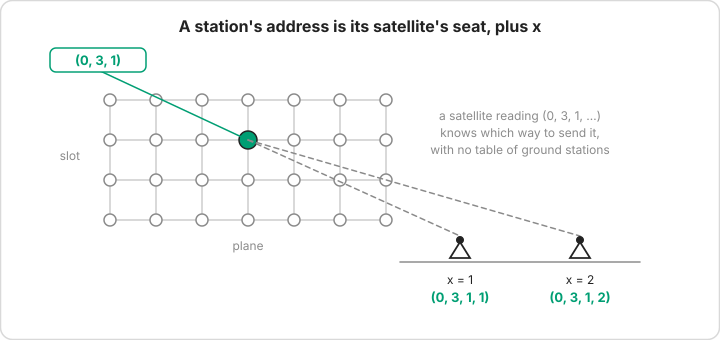
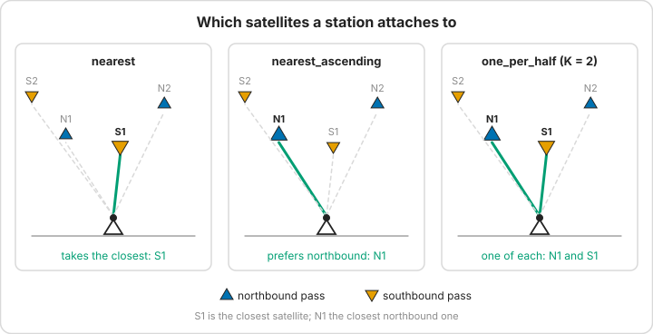
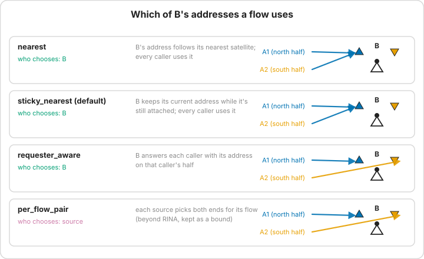

# How ground stations get their addresses

This page explains, without the formal model, why a ground station's address keeps changing, why that can cost tens of milliseconds, and what the two attachment policies LEOPath ships do about it. The reference version, with every option and counter, sits in [Routing Algorithms](algorithms.md#where-the-destination-address-comes-from).

## The address says where you are

In 6G-RUPA a satellite's address is its seat in the constellation: shell, plane and slot. A ground station doesn't get a seat of its own. It borrows the address of the satellite it's talking to and adds a small number, `x`, to tell itself apart from the other stations under that satellite:



That's what makes forwarding cheap. A satellite reading `(0, 3, 1, ...)` knows which way to send the packet from the address alone, the same way you know roughly where a street address is before you look it up, and it needs no table of ground stations at all.

The price is that satellites don't stay put. A satellite is overhead for a few minutes, then it's gone, and the station has to take an address under the next one. In 6G-RUPA terms the station *renumbers*: it keeps its name, gets a new address, tells the directory, and sends one flow update to the other end of each open flow so the flows carry on under the new address. Nothing gets dropped, because a flow is tied to its endpoints' names and ports, not to the address.



## Why the nearest satellite can be the wrong one

Picking the closest satellite sounds obviously right. On Walker delta shells (Starlink, Kuiper, Telesat) it often isn't, and the reason took us a while to see.

Satellites cross any given spot on two kinds of pass: some head north, some head south. Seen on the constellation's grid of planes and slots, the northbound ones and the southbound ones over the same city sit about half the grid apart. Two satellites can be 682 km from Nairobi at the same moment and still be on opposite sides of the network:



In the real case, on Starlink: the northbound satellite is plane 28, slot 0, 6 275 km from Mumbai's satellite (23 ms); the southbound one is plane 64, slot 11, 52 665 km away (178 ms).

So a station that grabs whichever satellite happens to be nearest is, a lot of the time, sitting on the half of the shell that's wrong for the person it's talking to, and every packet then travels round the planet to reach it. It doesn't matter how clever the routing is, because link-state pays exactly the same: the address points at the far side, and the packet has to go there.

Measured over 24 ground stations without failures, that costs on average 37 ms extra one way on Starlink, 32 ms on Telesat and 18 ms on Kuiper. OneWeb, a Walker star shell, loses about 7 ms, since its passes don't split into two halves the same way.

## Two fixes, both ordinary 6G-RUPA policies

Which half is right depends on both ends of the conversation, so no station can always get it right on its own. LEOPath implements two policies, a simple one and a better one, and neither needs anything outside 6G-RUPA: one is a choice the station makes about which satellite to attach to, the other is the directory taking the caller into account when it answers.




**Prefer northbound** (`gs_attachment_order: nearest_ascending`). Every station attaches to its nearest northbound satellite, falling back to a southbound one only when no northbound one is visible. If everyone sits on the same half, most pairs line up. It needs no coordination, and on the delta shells it cuts the extra delay by 40-60%. It can't fix pairs where the best route really does run through the southbound half at both ends, which is about a third of them.

**Smart directory** (`gs_attachment_order: one_per_half`, `gs_attachment_count: 2`, `gs_address_policy: requester_aware`). Every station holds two addresses at once, one under its nearest northbound satellite and one under its nearest southbound satellite, and accepts packets on either. When A opens a flow to B, B's side answers with whichever of B's two addresses suits A, and A sends through whichever of its own two satellites suits that address. The 6G-RUPA flow allocator already works this way (it follows the RINA specification): the destination returns its address in the reply to the flow request, and the request carries the caller's address.



| shell | nearest satellite | prefer northbound | smart directory |
| --- | --- | --- | --- |
| Starlink | 36.7 ms (p95 114) | 22.1 (67) | 8.2 (60) |
| Kuiper | 17.7 (63) | 7.5 (22) | 3.9 (29) |
| Telesat | 32.1 (110) | 13.0 (46) | 6.5 (21) |
| OneWeb | 7.4 (20) | 6.5 (12) | 4.0 (12) |




Extra one-way delay over the best possible route, mean with the 95th percentile in brackets, from 192 runs (`scripts/run-failure-sweep.sh`, variants `*_dir_*`).

The smart directory removes about 80% of the extra delay on delta shells, and it sends *fewer* flow updates than a single attachment (on Starlink 368 per snapshot against 436), because a flow only moves when the address it uses disappears. Holding two addresses does nothing by itself, though; with two addresses but the default policy, every flow still uses the station's one current address and the delay comes out the same as with one. The gain comes entirely from the directory answering per caller.

## When a satellite fails

A flow keeps its destination address while it's in use, and the satellites on the way can't swap it for one they like better. So when a link or a satellite fails, the forwarding rule can hit a dead end on the way to that address. The scheme handles it with exception entries: the satellite where the walk breaks gets one extra entry, "for destination satellite D, go this way", pointing along the shortest working path, and every flow heading for D in that snapshot shares it. Satellites learn about failures because only the failures get flooded; everything else they work out from the constellation's geometry.



## Trying it

Both policies are ordinary configuration. In the harness:

```bash
# prefer northbound
python -m leopath.experiments.eval_harness --config leopath/config/starlink.yaml \
    --algorithm topological_routing --gs-addressing attachment \
    --gs-attachment-count 1 --gs-attachment-order nearest_ascending

# smart directory
python -m leopath.experiments.eval_harness --config leopath/config/starlink.yaml \
    --algorithm topological_routing --gs-addressing attachment \
    --gs-attachment-count 2 --gs-attachment-order one_per_half \
    --gs-address-policy requester_aware
```

The same flags work for `shortest_path_link_state` and `dra_routing`, so all three route between the same addresses and differ only in how they forward. The failure sweep runs the full scheme under both policies as `topological_scheme_asc` and `topological_scheme_req`. Each run reports the extra delay as `delay_extra_ms`, renumberings as `aux_gs_current_address_changes` and flow updates as `aux_flow_update_messages`.

The diagrams on this page come from `scripts/make_doc_diagrams.py`; rerun it after changing one.

A snapshot simulator counts messages but can't time them, so the short window in which a station's old address still works after a change, and the packets in flight across it, aren't modelled.
