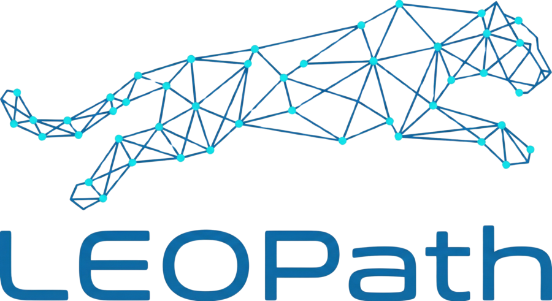

# LEOPath

  

  
  
  

Source code, issues and releases: [github.com/Fundacio-i2CAT/LEOPath](https://github.com/Fundacio-i2CAT/LEOPath).

LEOPath is a simulation framework for analyzing routing algorithms in Low Earth Orbit (LEO) satellite constellations.

It focuses on topology, connectivity, and forwarding state generation, enabling rapid comparison of routing strategies under realistic orbital dynamics.

## What LEOPath does

- Simulates LEO satellite motion using SGP4 and generated TLEs.
- Builds dynamic ISLs and GSLs with distance and visibility constraints.
- Computes forwarding state for multiple routing algorithms.
- Produces artifacts for analysis and downstream packet-level simulators.

## What LEOPath does not do

- Packet-level simulation (TCP/IP, queues, PHY details).

For packet-level studies, export forwarding state and integrate with tools like NS-3.

## Quick links

- [Quickstart](quickstart.md)
- [Configuration](configuration.md)
- [Routing algorithms](algorithms.md)
- [Evaluation](evaluation.md)
- [Experiments](experiments.md)
- [Constellation visualizations](visualizations.md)
